<h1 align="center">Harmony – Regenerative Workforce Incentives on Stellar</h1>

<p align="center">
  Turning real work into recurring on-chain income for Latin American workers.
</p>

---

## 🟢 What is Harmony?

Harmony is a Web3 incentive platform that helps companies – starting with logistics and warehouse teams – **measure real performance and pay fair, recurring bonuses on Stellar**.

Harmony focuses on **corporate onboarding**: each company creates or links wallets for their workers and sends periodic performance bonuses.  
Those wallets become **recurring income channels**, not one-time airdrops, and workers gain access to **on-chain financial services** (savings, basic DeFi, trading, off-ramp).

---

## 💥 Problem – What we are fixing (and how bad it is)

### 1. Inside companies (especially logistics)

Most small and mid-size companies in Latin America struggle with:

- **Low and unstable motivation**:  
  Workers feel their effort is rarely recognized. Performance peaks around payday and drops the rest of the month.
- **No clear way to measure performance**:  
  Tasks are managed via WhatsApp, paper or basic spreadsheets. It’s hard to know:
  - Who did what,
  - How long it took,
  - Whether it was done correctly.
- **Bonuses that feel arbitrary**:  
  Even when owners *want* to reward people, they lack **clear, verifiable metrics**, so incentives end up based on perception, favoritism or last-minute pressure.

This leads to:

- Less productivity and profitability  
- More mistakes in operations (especially in picking/packing)  
- Higher conflict inside the team  
- Difficulty meeting goals and keeping good workers

---

### 2. In the Web3 ecosystem

At the same time, **onboarding to Web3 is broken**:

- We create wallets at events, drop a few tokens…
- …and people **never use that wallet again**.
- There is no recurring value, no real habit, no connection to daily life.

Real, recurring income for millions of workers in LatAm still happens **off-chain** (cash, envelopes, payroll lines) while Web3 spins in circles creating wallets with no life.

If we don’t change this:

- Companies will keep seeing blockchain as “nice marketing” but not as operational infrastructure.
- Workers will remain excluded from Web3 tools that could genuinely help them (saving in stable assets, DeFi, off-ramp).
- The ecosystem will continue to burn resources on short-term airdrops with no long-term impact.

---

## ✅ Our Solution – Harmony

Harmony is an **automated rewards system** for worker performance, built on the **Stellar network** with **Soroban smart contracts**, designed for **logistics and warehouse operations** first.

We give companies:

- A **clear, tamper-proof record** of worker performance
- **Metrics** (tasks completed, quality, time) instead of opinions
- A way to send **periodic bonuses directly to each worker’s wallet**
- A simple, mobile-friendly app so supervisors and workers can actually use it on the warehouse floor

We give workers:

- **Clarity** on what they have to do, how, and by when  
- **Immediate recognition** every time they complete tasks correctly  
- **On-chain income** they receive monthly in a Stellar wallet  
- Access to **savings, DeFi, trading or off-ramp** using those tokens

---

## 🧩 How Harmony Addresses the Problem

### 1. From chaos to clear tasks

Harmony connects directly to the company's existing systems:

- The **ERP/WMS** sends orders automatically to Harmony
- Orders are transformed into **measurable activities**
- Each activity is registered on-chain via **Soroban Contract**
- Leaders review and approve, reject or skip activities

Workers see their orders with clear status: **Completed**, **Rejected** or **Skipped**.

---

### 2. From opinion to metrics

Harmony calculates on-chain metrics per worker and per month:

- Tasks completed
- Tasks OK / rejected
- Completion rate
- Total earnings (performance score)

All of this is stored on Soroban contracts and mirrored in SQL for analytics and Power BI dashboards.

> Companies move from "I *feel* you're not performing" to "Here is your **clear performance history**, stored on-chain."


---

### 3. From salary-only to recurring on-chain income

Each month:

1. The company deposits a **reward pool** in a Stellar asset (e.g. stablecoin).
2. The contract distributes that pool according to each worker’s **points**.
3. Workers **claim** their bonus directly into their wallets.

This creates:

- **Recurring activity** in wallets (not one-time airdrops).
- A direct link between **real work → on-chain value**.
- A natural, safe entry point to Web3 for workers.

---

## 🏗 Technical Architecture (Present)

---

## 🔄 User Flows

### Overview
```
┌─────────────────────────────────────────────────────────┐
│                    ⭐ HARMONY                            │
├─────────────────────────────────────────────────────────┤
│                                                         │
│   🏢 ENTERPRISE ──→ ⭐ HARMONY ──→ 📊 DASHBOARDS       │
│   (ERP/WMS)         (Soroban)       (Leader/Worker)    │
│                                                         │
├─────────────────────────────────────────────────────────┤
│                                                         │
│   👔 LEADER                    👷 WORKER                │
│   ┌──────────────┐            ┌──────────────┐         │
│   │ Activities   │            │ My Orders    │         │
│   │ Metrics      │            │ Performance  │         │
│   │ Workers      │            └──────────────┘         │
│   │ Vault        │                                     │
│   └──────────────┘                                     │
│                                                         │
└─────────────────────────────────────────────────────────┘
```

---

### Flow 1: System (Complementary)

How enterprise systems connect with Harmony:

```mermaid
flowchart LR
    subgraph EMPRESA["🏢 EMPRESA"]
        ERP["ERP / WMS"]
        ORDERS["Sistema de Órdenes"]
    end

    subgraph HARMONY["⭐ STELLAR HARMONY"]
        API["API Integration"]
        CHAIN["Soroban Contract"]
        DB[("Activities DB")]
    end

    subgraph DASHBOARDS["📊 DASHBOARDS"]
        LEADER["Leader"]
        WORKER["Worker"]
    end

    ERP --> API
    ORDERS --> API
    API --> CHAIN
    API --> DB
    CHAIN -.->|sync| DB
    DB --> LEADER
    DB --> WORKER
```


1. The company's ERP/WMS sends orders
2. Harmony transforms them into **measurable activities**
3. They are registered on-chain via **Soroban**
4. Data feeds both Leader and Worker dashboards

---

### Flow 2: Leader Dashboard

The leader manages activities, metrics, workers and funds through **4 modules**:

```mermaid
flowchart TD
    LOGIN["🔐 Login with Wallet"]
    DASH["📊 LEADER DASHBOARD"]
    
    LOGIN --> DASH
    
    DASH --> VAU
    DASH --> WOR
    DASH --> MET
    DASH --> ACT
    
    subgraph VAU_SUB["Vault"]
        VAU["🏦 VAULT"]
        VAU --> V1["Balance"]
        VAU --> V2["Recharge"]
        VAU --> V3["Transactions"]
    end
    
    subgraph WOR_SUB["Workers"]
        WOR["👥 WORKERS"]
        WOR --> W1["View Workers"]
        WOR --> W2["Add Worker"]
        W2 --> W3["Assign Wallet"]
    end
    
    subgraph MET_SUB["Metrics"]
        MET["📈 METRICS"]
        MET --> M1["Team Overview"]
        MET --> M2["Individual Stats"]
        M2 --> M3["Activity History"]
    end
    
    subgraph ACT_SUB["Activities"]
        ACT["📋 ACTIVITIES"]
        ACT --> A1["Pending Orders"]
        ACT --> A2["Efficiency"]
        ACT --> A3["Current Pool"]
        A1 --> A4{"Review"}
        A4 -->|Approve| A5["✅ Pay"]
        A4 -->|Reject| A6["❌ No Pay"]
        A4 -->|Skip| A7["⏭️ Later"]
    end
```


| Module | Function |
|--------|----------|
| **📋 Activities** | View pending orders, efficiency and current pool. Approve, reject or skip activities |
| **📈 Metrics** | Team and individual metrics. Select a worker → view activity history |
| **👥 Workers** | Add workers to the organization and assign wallets for payment distribution |
| **🏦 Vault** | View balance, recharge the pool and check transaction history |

---

### Flow 3: Worker Dashboard

The worker views their orders and performance through **2 views**:

```mermaid
flowchart TD
    LOGIN["🔐 Login with Wallet"]
    DASH["📊 WORKER DASHBOARD"]
    
    LOGIN --> DASH
    
    DASH --> PERF
    DASH --> ORD
    
    subgraph PERF_SUB["Performance"]
        PERF["📊 PERFORMANCE"]
        PERF --> P1["My Statistics"]
        PERF --> P2["Activity History"]
        P1 --> P3["Completion Rate"]
        P1 --> P4["Total Earnings"]
        P2 --> P5["Filter & Details"]
    end
    
    subgraph ORD_SUB["My Orders"]
        ORD["📦 MY ORDERS"]
        ORD --> O1["🟡 Skip"]
        ORD --> O2["🟢 Completed"]
        ORD --> O3["🔴 Rejected"]
    end
```


| Module | Function |
|--------|----------|
| **📦 My Orders** | View order status (Skip, Completed, Rejected) |
| **📊 Performance** | Personal statistics (completion rate, earnings) and detailed activity history |

### On-chain (Soroban)

- **Factory Contract**
  - Creates organization contracts.
  - Registers `org_id → org_address` + owner metadata.

- **Organization Contract (per company)**
  - Membership: join/leave/kick, roles (`owner`, `supervisor`, `worker`).
  - Activity templates (task types).
  - Tasks:
    - assignment, completion, review, evidence URLs.
    - scoring logic (base points, difficulty, quality factor).
  - Monthly reward pools:
    - fund period, close period, claim rewards.
  - On-chain stats per worker/period.

### Off-chain

- **Backend/API (Node or Python)**
  - Handles wallet-based auth.
  - Interacts with Soroban contracts.
  - Mirrors state into SQL Server / Azure SQL.
  - Exposes REST/GraphQL endpoints for the webapp.

- **Database (SQL Server)**
  - `Organizations`, `Members`, `ActivityTemplates`
  - `Tasks` with timestamps and evidence
  - `MemberPeriodStats` for fast analytics
  - Designed as **multi-tenant**: many companies, each with its own org contract and data namespace.

- **Webapp (Mobile-first)**
  - Workers:
    - view tasks, upload evidence (photos), mark as done
    - see their monthly score & rewards
  - Supervisors:
    - create/assign tasks
    - review pending tasks and score them
  - Admins:
    - configure organization, reward asset, periods
    - fund reward pools, close periods

---

## 🔮 Future – Where Harmony is Going

After the hackathon, Harmony has a clear path to production:

1. **Deeper logistics integration**
   - Connect to existing WMS/ERPs and digital twins.
   - Use QR/barcode scans to auto-create tasks and evidence.
   - Heatmaps of productivity by zone, shift, and worker.

2. **Advanced incentive design**
   - Multiple pools (quality bonus, safety bonus, team bonus).
   - Long-term streaks and badges on-chain.
   - Reputation portable across organizations (a worker’s on-chain track record follows them).

3. **Financial inclusion layer**
   - Savings vaults and simple DeFi products built on Stellar.
   - Educational content embedded in the app (“What is Stellar?”, “How to save safely?”).
   - Optional contribution to **community funds** (ReFi angle) – e.g. 1% of each pool goes to training, safety or wellbeing.

4. **LatAm-first, global-ready**
   - Start with logistics operations in Latin America (high informal work, high turnover).
   - Expand to retail, field services, and other blue-collar segments.
   - Offer white-label versions for HR/consulting firms.

---

## 🌎 Why this Matters for Latin America

- High levels of **labor demotivation** and **informality**.
- Limited access to **formal financial tools** for many workers.
- Companies under pressure to be more efficient while keeping costs under control.

Harmony:

- Helps companies **do more with the same people and space** by aligning incentives.
- Gives workers in LatAm a **first real use case for Web3**: bonuses they can actually use and understand.
- Uses Stellar’s low fees and fast settlement to make it viable even for **small bonuses**.

---

## 💚 Brand – Present & Future

**Purpose**  
> Empower more human, efficient and motivated companies through a fair, transparent and automated system that recognizes the real performance of every worker.

**Mission**  
Offer companies a Web3 tool that is **automated, reliable and metrics-based**, allowing them to recognize good performance in (near) real time and sustain motivation over time.

**Vision**  
Become the leading Web3 performance recognition platform in Latin America and beyond, transforming how companies and workers relate through transparent, immediate and measurable incentives.

**Values**

- Transparency – real, traceable, tamper-proof data  
- Fairness – rewards based on verifiable merit, not favoritism  
- Innovation – using blockchain to improve everyday work  
- Human-centric – people at the center of performance  
- Efficiency – less bureaucracy, more action  
- Trust – secure records and predictable processes  

**Taglines**

- “Motiva mejor. Gestiona mejor. Crece mejor.” 
- “Real metrics, real rewards.” 
- “Un sistema justo para un trabajo justo.”

---

## 🧪 Scope for this Hackathon

For this hackathon we focus on **execution**:

- ✅ Soroban Factory contract + Organization contract MVP  
- ✅ Core flows:
  - create org, join org, create activities, assign tasks
  - worker marks done, supervisor reviews & scores
  - monthly pool distribution + claim  
- ✅ SQL schema and basic API for stats  
- ✅ Mobile-first webapp for workers and supervisors  
- ✅ Demo scenario: “Juan” in a logistics company in Latin America

The code will prioritize:

- Clear, documented smart contract interfaces  
- Robust data modeling (on-chain + SQL)  
- Clean separation of concerns (contracts / backend / UI)  
- A realistic path to production with real companies

---

## 🚀 Getting Started 

1. **Clone the repo**

```bash
git clone https://github.com/your-org/harmony.git
cd harmony
